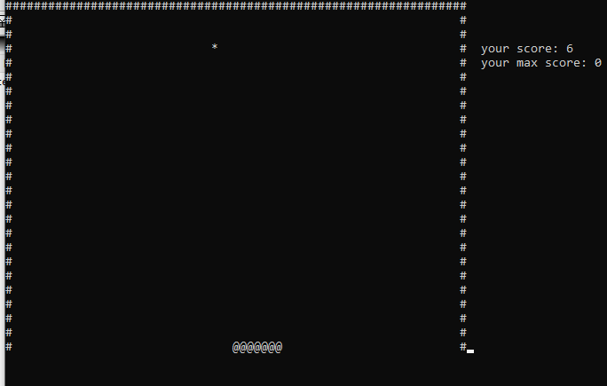

# cProjects

## Usage
Clone this repository
```bash
git clone https://github.com/anixne/cprojects
```

<details>
<summary>atgame</summary>
  
### Windows
```
bin\atgame.exe
```
### Linux
to run the executable file you will need wine.
```bash
wine bin/atgame.exe
```


### Gameplay
E - exit <br>
W - up <br>
S - down <br>
A - left <br>
D - right. <br>

Enjoy.


### Conclusion
If you have problems or ideas create a new issue.
  </details>
<details>
<summary> arkanoid</summary>
  
### Windows
```
bin\arkanoid.exe
```
### Linux
to run the executable file you will need wine.
```bash
wine bin/arkanoid.exe
```
  
  
 ### Gameplay
Esc - exit <br>
W - start <br>
A - left <br>
D - right. <br>
  
Enjoy.



  </details>
<details>
  <summary>snowGenerator</summary>
  
### simple snow generator on console:)
```
  
### Windows
```
bin\genesnow.exe
```
### Linux
to run the executable file you will need wine.
```bash
wine bin/genesnow.exe
```


  
</details>  
