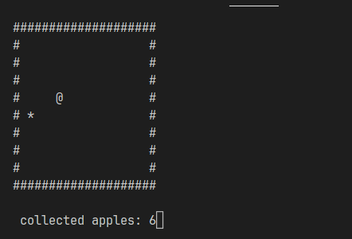

# atgame

## Usage
Clone this repository
```bash
git clone https://github.com/anixne/cprojects
```

### Windows
```
bin\atgame.exe
```
### Linux
to run the executable file you will need wine.
```bash
wine bin/atgame.exe
```


### Gameplay
W - up <br>
S - down <br>
A - left <br>
D - right. <br>
E - exit.

Enjoy.




### Conclusion
If you have problems or ideas create a new issue.
